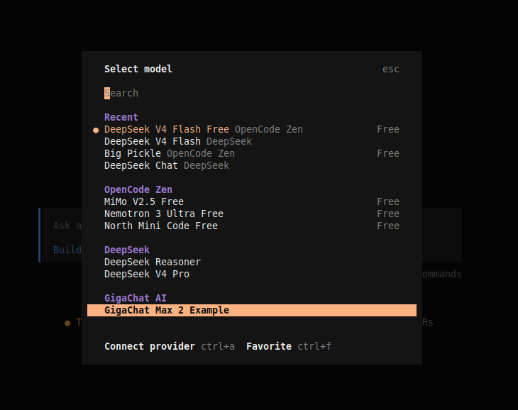
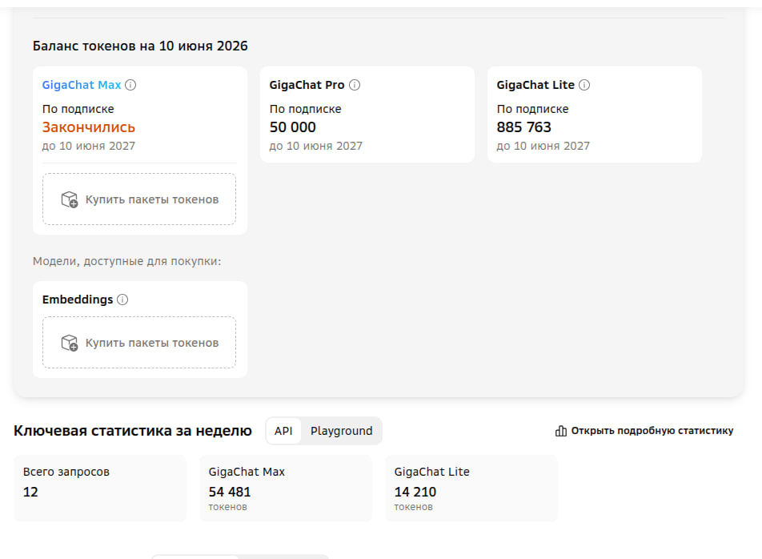
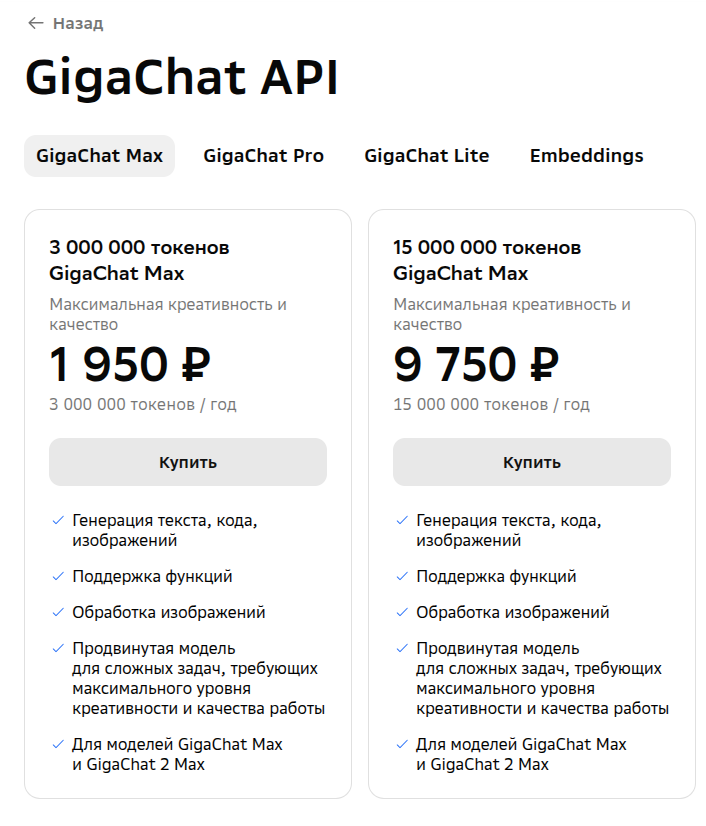

GigaChat и OpenCode
=====================

# Создаём аккаунт и получаем ключи к API

[Личный кабинет ГигаЧата](https://developers.sber.ru/studio/)

```
Authorization Key: y03Y***************************************NTI3MzRmMw==
```

# Запускаем прокси запросов

После того, как у вас получилось добыть токен для API, вы всё еще не сможете 
взять и использовать GigaChat вместе с OpenCode. Дело в том, что сам OpenCode 
не поддерживает GigaChat как провайдера. А у GigaChat свой собственный формат 
API, и подключить его как кастомный провайдер не получится. 

Но не расстраивайтесь: добрые люди уже написали [прокси](https://gitverse.ru/kmpavloff/openai-provider-gigachat), 
которая превращает API GigaChat в совместимый с OpenAI API.

## Клонируем репозиторий

```
git clone git@gitverse.ru:kmpavloff/openai-provider-gigachat.git
```
Получаем:
```
git clone git@gitverse.ru:kmpavloff/openai-provider-gigachat.git
Клонирование в «openai-provider-gigachat»...
The authenticity of host 'gitverse.ru (178.248.237.106)' can't be established.
RSA key fingerprint is SHA256:IL4khwaSrT4uHCu9LTUW7dRJyMB5XkOJnFrP0nmdMXU.
This key is not known by any other names.
Are you sure you want to continue connecting (yes/no/[fingerprint])? yes
Warning: Permanently added 'gitverse.ru' (RSA) to the list of known hosts.
git@gitverse.ru: Permission denied (publickey).
fatal: Не удалось прочитать из внешнего репозитория.

Удостоверьтесь, что у вас есть необходимые права доступа
и репозиторий существует.
```

Да. Надо завести аккаунт ещё и на gitverse.ru и добавить туда свой 
[публичный ssh-ключ](https://gitverse.ru/settings/keys?onboarding=true)

Теперь порядок

```bash
$ git clone git@gitverse.ru:kmpavloff/openai-provider-gigachat.git
Клонирование в «openai-provider-gigachat»...
remote: Enumerating objects: 136, done.
remote: Counting objects: 100% (136/136), done.
remote: Compressing objects: 100% (132/132), done.
remote: Total 136 (delta 76), reused 0 (delta 0), pack-reused 0 (from 0)
Получение объектов: 100% (136/136), 325.19 КиБ | 1.73 МиБ/с, готово.
Определение изменений: 100% (76/76), готово.

```
## Загрузка сертификата от минцифры

Скачиваем [сертификаты от минцифры](https://www.gosuslugi.ru/crt) в каталог `ca-certs`


## Настраиваем конфиг

Переходи в склонированный репозиторий
```bash
cd openai-provider-gigachat
```

Копируем шаблон конфига
```bash
cp config.example.json config.json
```

Вносим туда свои доступы к GigaChat
```bash
{
  "authorization_key": "API_KEY",
  "oauth_url": "https://ngw.devices.sberbank.ru:9443/api/v2/oauth",
  "scope": "GIGACHAT_API_PERS",
  "addr": "localhost",
  "port": "8880"
}
```

- `authorization_key` — ключ авторизации GigaChat API, это обязательный параметр. Как раз сюда укажете свой API-ключ.
- `oauth_url` — URL для получения токена доступа. По умолчанию: https://ngw.devices.sberbank.ru:9443/api/v2/oauth. И в принципе его не нужно менять.
- `scope` — область доступа API. По умолчанию это GIGACHAT_API_PERS, и вам его тоже не стоит менять.
- `port` - порт, который будет слушать прокси на локальной машине

## Запускаем прокси 

```
go run .
```

Упс

```
Команда «go» не найдена, но может быть установлена с помощью:
sudo apt install golang-go  # version 2:1.21~2, or
sudo apt install gccgo-go   # version 2:1.21~2
```

Да, прокси написан на golang и его надо установить

Ставим по [инструкции](https://go.dev/doc/install)

А теперь можно и запустть наш прокси
```
go run .
```

```
go: downloading github.com/google/uuid v1.6.0
2026/06/10 14:55:34 Logging to file: logs/server_2026-06-10_14-55-34.log
[INFO ] 2026-06-10 14:55:34.907 Config loaded: OAuth URL: https://ngw.devices.sberbank.ru:9443/api/v2/oauth, Scope: GIGACHAT_API_PERS, CA cert dir: ca-cert
[INFO ] 2026-06-10 14:55:34.923 Loaded 2 CA certificate file(s) from ca-cert
[INFO ] 2026-06-10 14:55:34.923 Starting OpenAI-compatible provider for GigaChat
[INFO ] 2026-06-10 14:55:34.923 Base URL: http://localhost:8080/v1
[INFO ] 2026-06-10 14:55:34.923 Config: config.json, Log Level: INFO
[INFO ] 2026-06-10 14:55:34.923 Health check: curl -X GET http://localhost:8080/v1/models -H "Authorization: Bearer test"
```

# Подключаем гигачат-прокси к opencode

## Создаём нового провайдера API

В корне проекта делаем

```
opencode auth login
```
видим
```
$ opencode auth login

┌  Add credential
│
◆  Select provider

│  Search: _
│  ● OpenCode Zen (recommended)
│  ○ OpenAI
│  ○ GitHub Copilot
│  ○ Google
│  ○ Anthropic
│  ○ OpenRouter
│  ○ Vercel AI Gateway
│  ...
│  ↑/↓ to select • Enter: confirm • Type: to search
└
```
Выбираем `Other` в самом низу

```
  Add credential
│
◆  Select provider

│  Search:
│  ...
│  ○ evroc
│  ○ iFlow
│  ○ routing.run
│  ○ submodel
│  ○ v0
│  ○ xAI
│  ● Other
│  ↑/↓ to select • Enter: confirm • Type: to search
└
```

Вводим `provider id` и абсолютно любой `API Key`, например `qwertyuiop`

```
┌  Add credential
│
◇  Select provider
│  Other
│
◇  Enter provider id
│  gigachat
│
▲  This only stores a credential for gigachat - you will need configure it in opencode.json, check the docs for examples.
│
◇  Enter your API key
│  ▪▪▪▪▪▪▪▪▪▪
│
└  Done

```
## Сохраняем настройки провайдера API

В корне проекта сохраняем файл `opencode.json`

В `apyKey` указываем наш настоящий ключ

```json
{
  "$schema": "https://opencode.ai/config.json",
  "provider": {
    "gigachat": {
      "npm": "@ai-sdk/openai-compatible",
      "name": "GigaChat AI",
      "options": {
        "baseURL": "http://localhost:8880/v1",
        "apiKey": "*************"
      },
      "models": {
        "GigaChat-2-Max": {
          "name": "GigaChat Max 2 Example"
        }
      }
    }
  }
}
```

## Запускаем opencode с моделью GigaChat

```
opencode
```


```
/models
```



## Пробуем на простейше задаче

Промпт в файле - [`docs/Agents/Tasks/MPD-268.md`](../../../../docs/Agents/Tasks/MPD-268.md)

И он у меня сожрал 50К бесплатных токенов ГОДОВОГО лимита на модели GigaChat-2-MAX, так и не 
завершив задачу



И предложил мне ещё 3М докупить за 2 тыщи.



Пожалуй я потом вернусь к гигачату, но инструкцию оставлю.