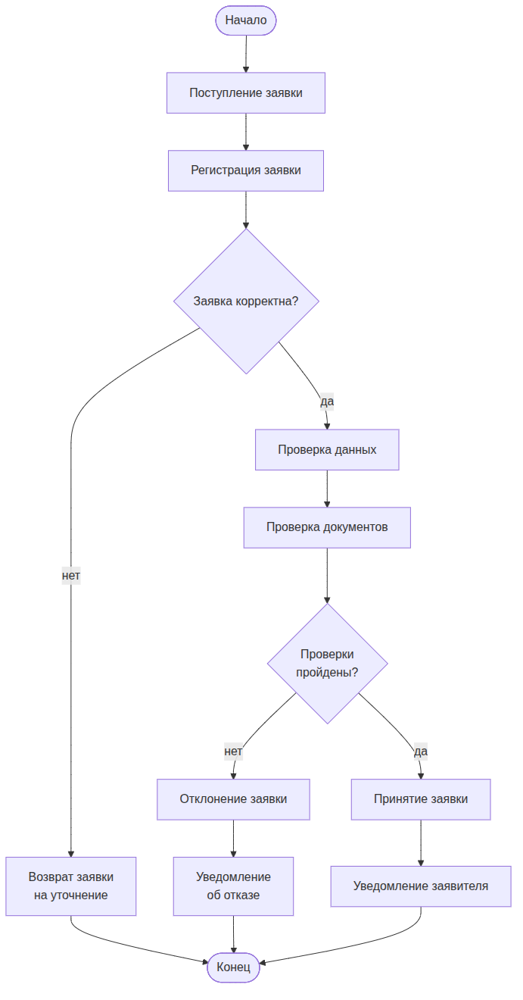
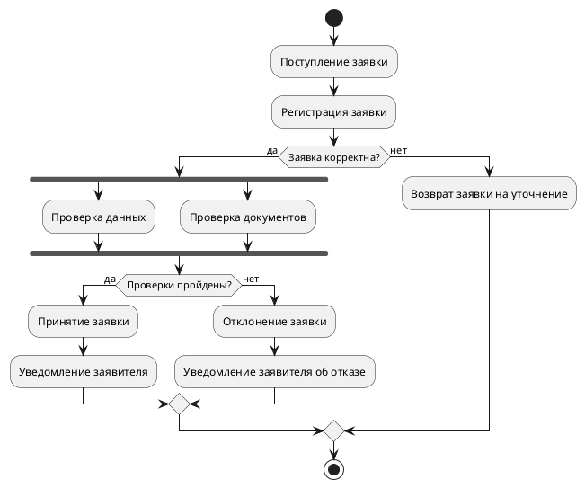

UML. Диаграмма деятельности
===========================

## Назначение

Диаграмма деятельности описывает динамику процесса: последовательность действий, условия ветвления, параллельные потоки и точки синхронизации. Применяется для моделирования бизнес-процессов, алгоритмов и сценариев работы системы.

## Описание примера

Показан процесс обработки заявки: поступление и регистрация, проверка корректности, параллельная проверка данных и документов, ветвление по итогам проверок, принятие или отклонение заявки и уведомление заявителя.

# Mermaid

## Код

### Вариант 1. Алиасы в квадратных скобках

```
flowchart TD
    Start([Начало]) --> ApplicationReceived[Поступление заявки]
    ApplicationReceived --> ApplicationRegistered[Регистрация заявки]
    ApplicationRegistered --> IsApplicationValid{Заявка корректна?}
    IsApplicationValid -->|нет| ReturnedForClarification[Возврат заявки<br>на уточнение]
    ReturnedForClarification --> End([Конец])
    IsApplicationValid -->|да| DataCheck[Проверка данных]
    DataCheck --> DocumentCheck[Проверка документов]
    DocumentCheck --> AreChecksPassed{Проверки<br>пройдены?}
    AreChecksPassed -->|нет| ApplicationRejected[Отклонение заявки]
    ApplicationRejected --> RejectionNoticeSent[Уведомление<br>об отказе]
    RejectionNoticeSent --> End
    AreChecksPassed -->|да| ApplicationAccepted[Принятие заявки]
    ApplicationAccepted --> ApplicantNotified[Уведомление заявителя]
    ApplicantNotified --> End
```

### Вариант 2. Алиасы в разделе определений

```
flowchart TD
    Start([Начало])
    ApplicationReceived[Поступление заявки]
    ApplicationRegistered[Регистрация заявки]
    IsApplicationValid{Заявка корректна?}
    ReturnedForClarification[Возврат заявки<br>на уточнение]
    DataCheck[Проверка данных]
    DocumentCheck[Проверка документов]
    AreChecksPassed{Проверки<br>пройдены?}
    ApplicationRejected[Отклонение заявки]
    RejectionNoticeSent[Уведомление<br>об отказе]
    ApplicationAccepted[Принятие заявки]
    ApplicantNotified[Уведомление заявителя]
    End([Конец])

    Start --> ApplicationReceived
    ApplicationReceived --> ApplicationRegistered
    ApplicationRegistered --> IsApplicationValid
    IsApplicationValid -->|нет| ReturnedForClarification
    ReturnedForClarification --> End
    IsApplicationValid -->|да| DataCheck
    DataCheck --> DocumentCheck
    DocumentCheck --> AreChecksPassed
    AreChecksPassed -->|нет| ApplicationRejected
    ApplicationRejected --> RejectionNoticeSent
    RejectionNoticeSent --> End
    AreChecksPassed -->|да| ApplicationAccepted
    ApplicationAccepted --> ApplicantNotified
    ApplicantNotified --> End
```

## Вид диаграммы в GitHub или Gitlab
(Если поддерживается плагин)


## Изображение диаграммы



# PlantUml

## Код

[В отдельном файле](./activity_dia_01.wsd)

## Изображение


