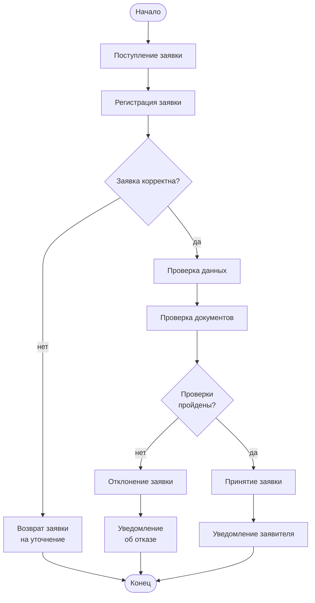

UML. Диаграмма деятельности
===========================

# Mermaid

## Код

```
flowchart TD
    Start([Начало]) --> A[Поступление заявки]
    A --> B[Регистрация заявки]
    B --> C{Заявка корректна?}
    C -->|нет| K[Возврат заявки<br>на уточнение]
    K --> Stop([Конец])
    C -->|да| D[Проверка данных]
    D --> E[Проверка документов]
    E --> F{Проверки<br>пройдены?}
    F -->|нет| I[Отклонение заявки]
    I --> J[Уведомление<br>об отказе]
    J --> Stop
    F -->|да| G[Принятие заявки]
    G --> H[Уведомление заявителя]
    H --> Stop
```

## Вид диаграммы в GitHub или Gitlab
(Если поддерживается плагин)


## Изображение диаграммы


# PlantUml

## Код

[В отдельном файле](./activity_dia_01.wsd)

## Изображение


