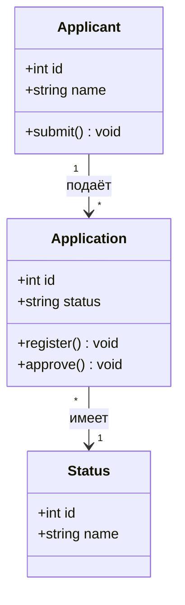
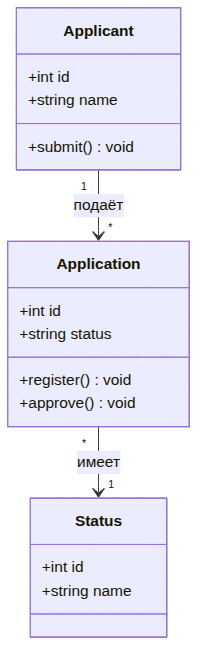
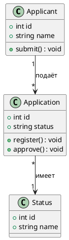

UML. Диаграмма классов
======================

## Назначение

Диаграмма классов описывает статическую структуру системы: классы, их атрибуты, методы и отношения между классами (ассоциации, наследование, композиция). Применяется для проектирования объектной модели и модели данных.

## Описание примера

Показана предметная область обработки заявок: заявитель (`Applicant`) подаёт множество заявок (`Application`), каждая заявка имеет один текущий статус (`Status`). Приведены ключевые атрибуты и методы классов.

# Mermaid

## Код

```
classDiagram
    class Applicant {
        +int id
        +string name
        +submit() void
    }
    class Application {
        +int id
        +string status
        +register() void
        +approve() void
    }
    class Status {
        +int id
        +string name
    }

    Applicant "1" --> "*" Application : подаёт
    Application "*" --> "1" Status : имеет
```

## Вид диаграммы в GitHub или Gitlab
(Если поддерживается плагин)


## Изображение диаграммы



# PlantUml

## Код

[В отдельном файле](./class_dia_01.wsd)

## Изображение


