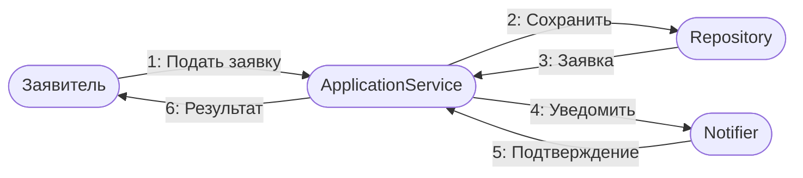
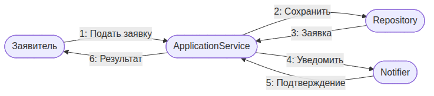
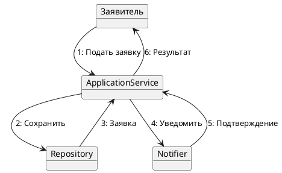

UML. Диаграмма коммуникации
===========================

## Назначение

Диаграмма коммуникации описывает взаимодействие объектов, акцентируясь на связях между ними, а не на времени; сообщения нумеруются, задавая порядок. Применяется для анализа взаимодействия и структуры связей.

## Описание примера

Показан сценарий обработки заявки с нумерованной последовательностью сообщений между заявителем, сервисом, репозиторием и сервисом уведомлений.

# Mermaid
(Mermaid не поддерживает диаграммы коммуникации напрямую; приведено приближение через `flowchart` с нумерацией сообщений)

## Код

```
flowchart LR
    Applicant([Заявитель])
    ApplicationService([ApplicationService])
    Repository([Repository])
    Notifier([Notifier])

    Applicant -->|1: Подать заявку| ApplicationService
    ApplicationService -->|2: Сохранить| Repository
    Repository -->|3: Заявка| ApplicationService
    ApplicationService -->|4: Уведомить| Notifier
    Notifier -->|5: Подтверждение| ApplicationService
    ApplicationService -->|6: Результат| Applicant
```

## Вид диаграммы в GitHub или Gitlab
(Если поддерживается плагин)


## Изображение диаграммы



# PlantUml
(PlantUML не поддерживает диаграммы коммуникации напрямую; приведено приближение через диаграмму объектов)

## Код

[В отдельном файле](./communication_dia_01.wsd)

## Изображение


