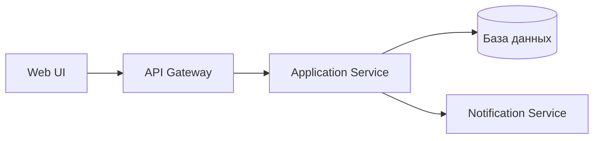
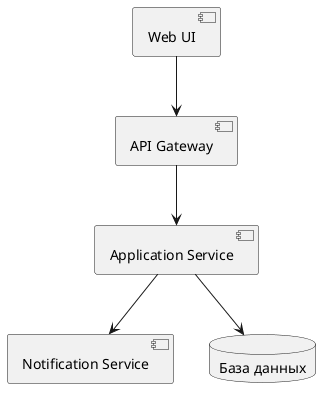

UML. Диаграмма компонентов
==========================

## Назначение

Диаграмма компонентов описывает компоненты системы и связи между ними через предоставляемые и требуемые интерфейсы. Применяется для проектирования архитектуры ПО и разбиения её на модули.

## Описание примера

Показана архитектура сервиса: `Web UI` обращается к `API Gateway`, который вызывает `Application Service`; последний работает с базой данных и сервисом уведомлений `Notification Service`.

# Mermaid
(Mermaid не поддерживает диаграммы компонентов напрямую; приведено приближение через `flowchart`)

## Код

```
flowchart LR
    WebUI[Web UI]
    ApiGateway[API Gateway]
    ApplicationService[Application Service]
    NotificationService[Notification Service]
    Database[(База данных)]

    WebUI --> ApiGateway
    ApiGateway --> ApplicationService
    ApplicationService --> Database
    ApplicationService --> NotificationService
```

## Вид диаграммы в GitHub или Gitlab
(Если поддерживается плагин)


## Изображение диаграммы


# PlantUml

## Код

[В отдельном файле](./component_dia_01.wsd)

## Изображение


