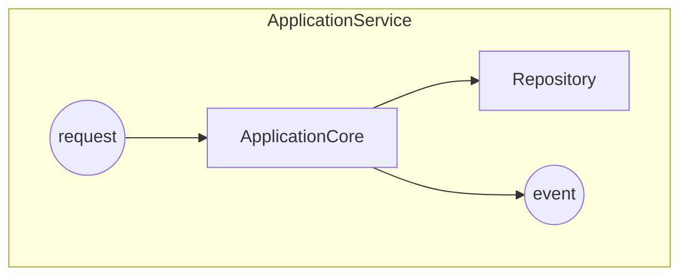
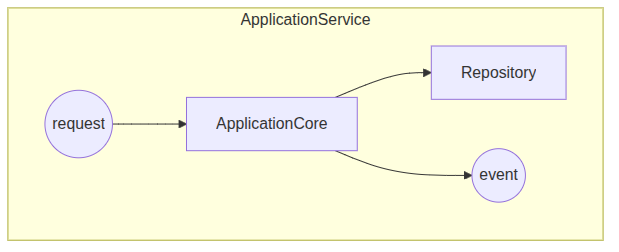
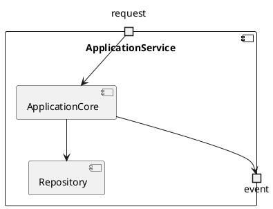

UML. Диаграмма композитной структуры
====================================

## Назначение

Диаграмма композитной структуры описывает внутреннее устройство класса или компонента: его части, порты и связи между ними во время выполнения. Применяется для детализации архитектуры отдельных компонентов.

## Описание примера

Показан компонент `ApplicationService` с входным портом `request`, выходным `event` и внутренними частями `ApplicationCore` и `Repository`, связанными потоками вызовов.

# Mermaid
(Mermaid не поддерживает диаграммы композитной структуры напрямую; приведено приближение через `flowchart` с подграфом и портами)

## Код

```
flowchart TB
    subgraph ApplicationService["ApplicationService"]
        PortIn((request))
        PortOut((event))
        ApplicationCore[ApplicationCore]
        Repository[Repository]

        PortIn --> ApplicationCore
        ApplicationCore --> Repository
        ApplicationCore --> PortOut
    end
```

## Вид диаграммы в GitHub или Gitlab
(Если поддерживается плагин)


## Изображение диаграммы



# PlantUml

## Код

[В отдельном файле](./composite_dia_01.wsd)

## Изображение


