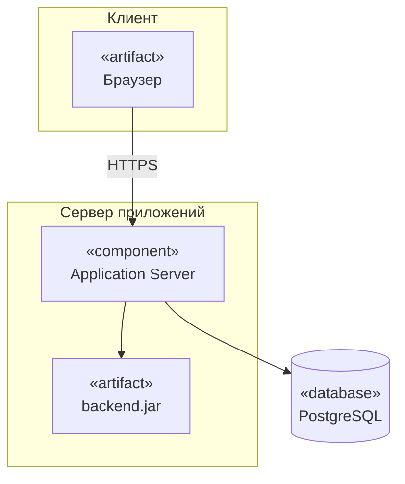
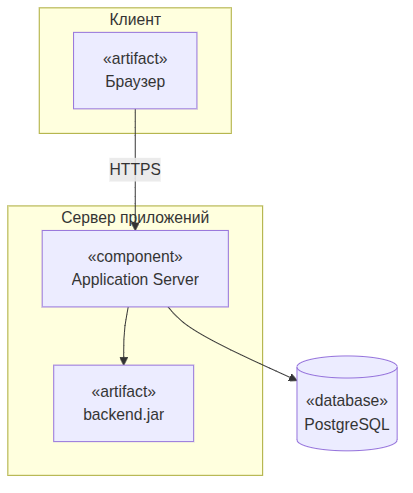
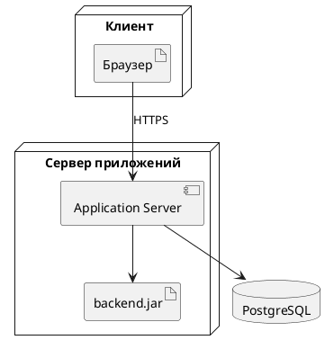

UML. Диаграмма развёртывания
============================

## Назначение

Диаграмма развёртывания описывает физическое размещение артефактов ПО на узлах (серверах, устройствах) и связи между узлами. Применяется для проектирования инфраструктуры и топологии развёртывания.

## Описание примера

Показано развёртывание: браузер на узле «Клиент» обращается по HTTPS к серверу приложений, на котором размещены `Application Server` и `backend.jar`; сервер работает с СУБД `PostgreSQL`.

# Mermaid
(Mermaid не поддерживает диаграммы развёртывания напрямую; приведено приближение через `flowchart` со стереотипами)

## Код

```
flowchart TB
    subgraph ClientNode["Клиент"]
        Browser["«artifact»<br>Браузер"]
    end
    subgraph AppServerNode["Сервер приложений"]
        AppServer["«component»<br>Application Server"]
        Backend["«artifact»<br>backend.jar"]
    end
    Database[("«database»<br>PostgreSQL")]

    Browser -->|HTTPS| AppServer
    AppServer --> Backend
    AppServer --> Database
```

## Вид диаграммы в GitHub или Gitlab
(Если поддерживается плагин)


## Изображение диаграммы



# PlantUml

## Код

[В отдельном файле](./deployment_dia_01.wsd)

## Изображение


