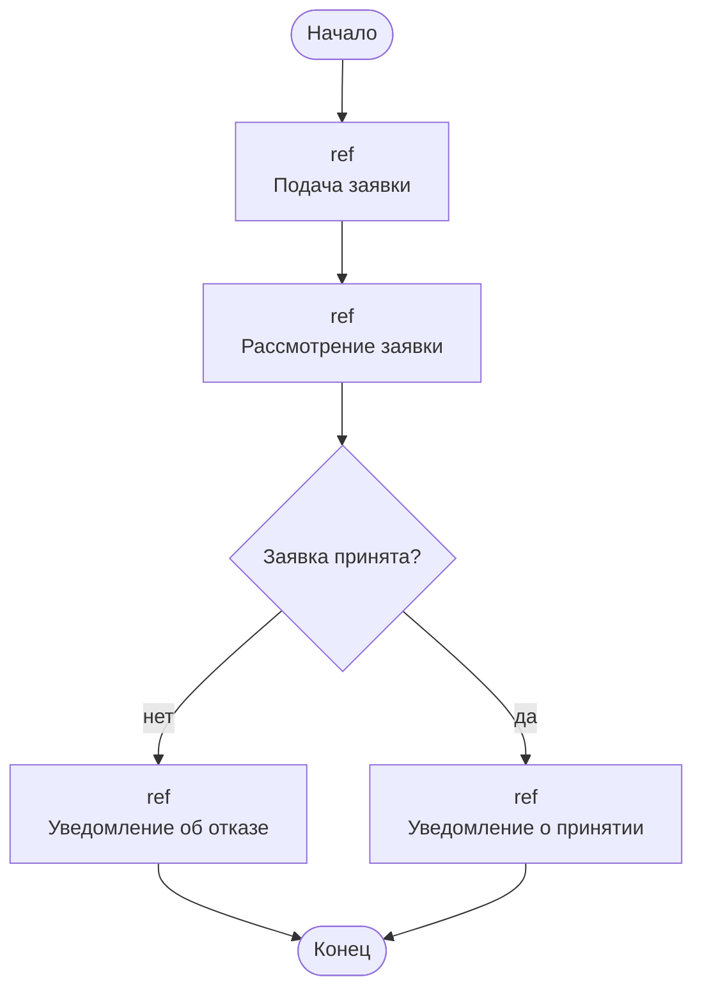
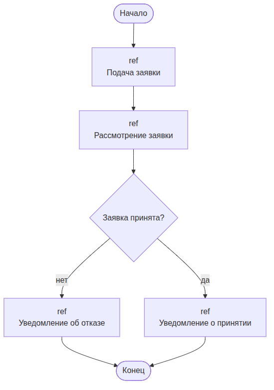
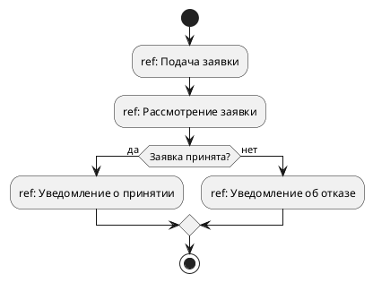

UML. Диаграмма обзора взаимодействия
====================================

## Назначение

Диаграмма обзора взаимодействия объединяет элементы диаграмм деятельности и последовательности: показывает поток управления между вложенными взаимодействиями (ссылками `ref`). Применяется для обзора сложных сценариев.

## Описание примера

Показана общая последовательность: подача заявки, её рассмотрение, ветвление по решению о принятии и уведомление заявителя о принятии или отказе.

# Mermaid
(Mermaid не поддерживает диаграммы обзора взаимодействия напрямую; приведено приближение через `flowchart` с узлами-ссылками `ref`)

## Код

```
flowchart TD
    Start([Начало])
    RefSubmit["ref<br>Подача заявки"]
    RefReview["ref<br>Рассмотрение заявки"]
    IsAccepted{Заявка принята?}
    RefReject["ref<br>Уведомление об отказе"]
    RefAccept["ref<br>Уведомление о принятии"]
    End([Конец])

    Start --> RefSubmit
    RefSubmit --> RefReview
    RefReview --> IsAccepted
    IsAccepted -->|нет| RefReject
    IsAccepted -->|да| RefAccept
    RefReject --> End
    RefAccept --> End
```

## Вид диаграммы в GitHub или Gitlab
(Если поддерживается плагин)


## Изображение диаграммы



# PlantUml
(PlantUML не поддерживает диаграммы обзора взаимодействия напрямую; приведено приближение через диаграмму деятельности)

## Код

[В отдельном файле](./interaction_dia_01.wsd)

## Изображение


