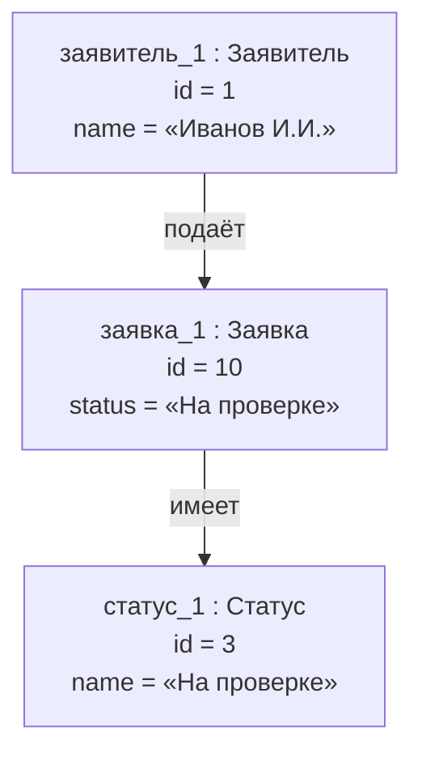
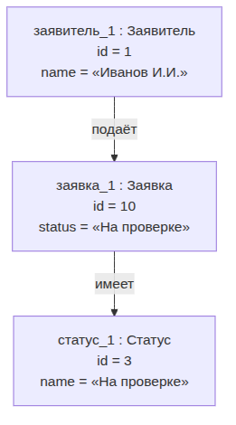
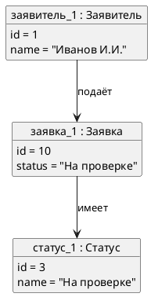

UML. Диаграмма объектов
=======================

## Назначение

Диаграмма объектов является снимком системы в конкретный момент времени: показывает экземпляры классов (объекты) со значениями атрибутов и связи между ними. Применяется для иллюстрации конкретных ситуаций и тестовых данных.

## Описание примера

Показан конкретный набор объектов: `заявитель_1`, `заявка_1` со статусом «На проверке» и соответствующий объект `статус_1`, связанные отношениями подачи и принадлежности статуса.

# Mermaid
(Mermaid не поддерживает диаграммы объектов напрямую; приведено приближение через `flowchart`)

## Код

```
flowchart TD
    Applicant1["заявитель_1 : Заявитель<br>id = 1<br>name = «Иванов И.И.»"]
    Application1["заявка_1 : Заявка<br>id = 10<br>status = «На проверке»"]
    Status1["статус_1 : Статус<br>id = 3<br>name = «На проверке»"]

    Applicant1 -->|подаёт| Application1
    Application1 -->|имеет| Status1
```

## Вид диаграммы в GitHub или Gitlab
(Если поддерживается плагин)


## Изображение диаграммы



# PlantUml

## Код

[В отдельном файле](./object_dia_01.wsd)

## Изображение


