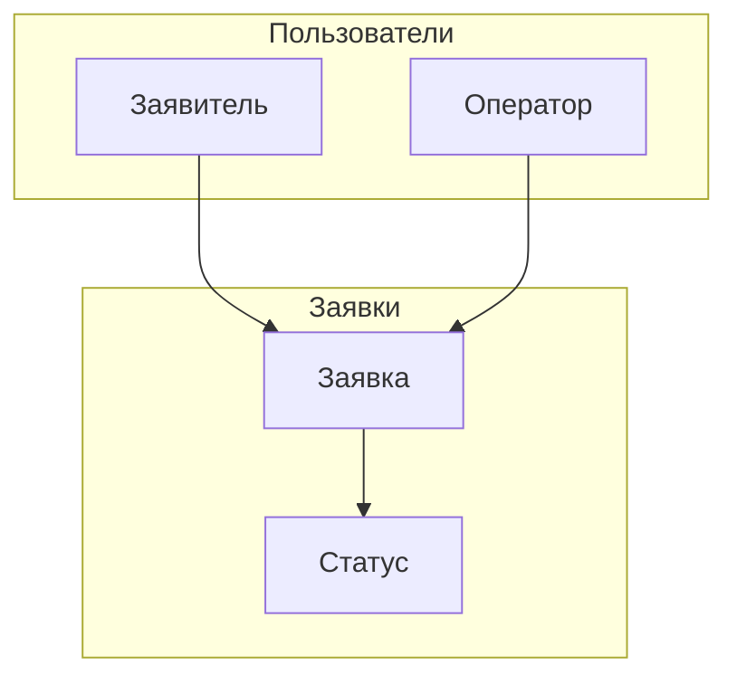
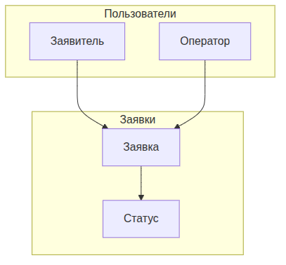
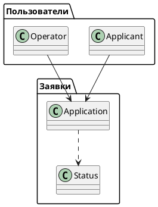

UML. Диаграмма пакетов
======================

## Назначение

Диаграмма пакетов описывает группировку элементов модели по пакетам и зависимости между ними. Применяется для отображения крупномасштабной структуры системы и разбиения её на модули.

## Описание примера

Модель разделена на пакеты «Пользователи» (`Applicant`, `Operator`) и «Заявки» (`Application`, `Status`) с зависимостями между ними.

# Mermaid
(Mermaid не поддерживает диаграммы пакетов напрямую; приведено приближение через `flowchart` с подграфами)

## Код

```
flowchart TD
    subgraph PackageUsers["Пользователи"]
        Applicant[Заявитель]
        Operator[Оператор]
    end
    subgraph PackageApplications["Заявки"]
        Application[Заявка]
        Status[Статус]
    end

    Applicant --> Application
    Operator --> Application
    Application --> Status
```

## Вид диаграммы в GitHub или Gitlab
(Если поддерживается плагин)


## Изображение диаграммы



# PlantUml

## Код

[В отдельном файле](./package_dia_01.wsd)

## Изображение


