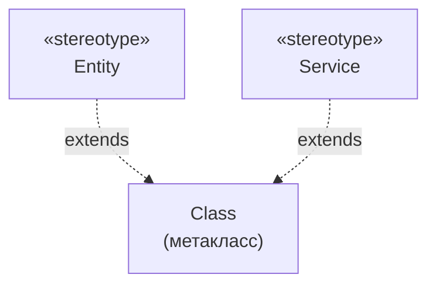
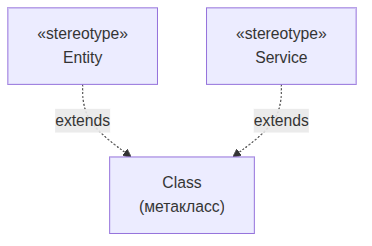
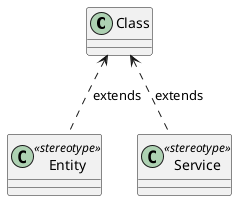

UML. Диаграмма профилей
=======================

## Назначение

Диаграмма профилей описывает расширения UML: стереотипы, их свойства (теги) и ограничения, применяемые к элементам модели. Применяется для адаптации UML под конкретную предметную область или платформу.

## Описание примера

Показан профиль со стереотипами `Entity` и `Service`, расширяющими метакласс `Class`, для классификации элементов модели.

# Mermaid
(Mermaid не поддерживает диаграммы профилей напрямую; приведено приближение через `flowchart`)

## Код

```
flowchart TD
    MetaClass["Class<br>(метакласс)"]
    Entity["«stereotype»<br>Entity"]
    Service["«stereotype»<br>Service"]

    Entity -.->|extends| MetaClass
    Service -.->|extends| MetaClass
```

## Вид диаграммы в GitHub или Gitlab
(Если поддерживается плагин)


## Изображение диаграммы



# PlantUml

## Код

[В отдельном файле](./profile_dia_01.wsd)

## Изображение


