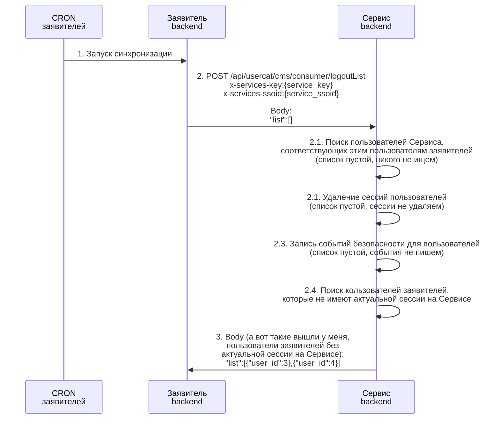
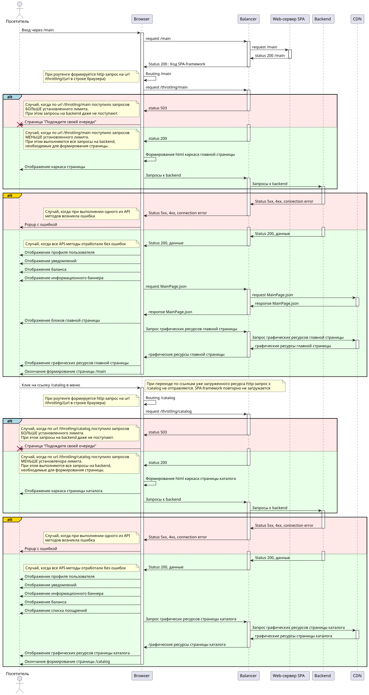

UML. Диаграмма последовательности
========

# Mermaid

## Код диаграммы

```
sequenceDiagram

    participant Consumer_cron as CRON<br>заявителей
    participant Consumer_backend as Заявитель<br/>backend
    participant Service_backend as Сервис<br/>backend


    Consumer_cron ->> Consumer_backend : 1. Запуск синхронизации
    Consumer_backend ->> Service_backend : 2. POST /api/usercat/cms/consumer/logoutList<br>x-services-key:{service_key}<br>x-services-ssoid:{service_ssoid}<br><br>Body: <br> "list":[]
    
    Service_backend ->> Service_backend : 2.1. Поиск пользователей Сервиса, <br>соответствующих этим пользователям заявителей<br/>(список пустой, никого не ищем)
    Service_backend ->> Service_backend : 2.1. Удаление сессий пользователей <br>(список пустой, сессии не удаляем)
    Service_backend ->> Service_backend : 2.3. Запись событий безопасности для пользователей <br>(список пустой, события не пишем)
    Service_backend ->> Service_backend : 2.4. Поиск кользователей заявителей, <br/>которые не имеют актуальной сессии на Сервисе 
    
    Service_backend ->> Consumer_backend : 3. Body (а вот такие вышли у меня,<br>пользователи заявителей без <br>актуальной сессии на Сервисе):<br>"list":[{"user_id":3},{"user_id":4}]

```

## Вид диаграммы в GitHub или Gitlab
(Если поддерживается плагин)


## Изображение диаграммы
(если плагин Mermaid в github или gitlab не поддерживается)


# PlantUml

## Код
```
@startuml "spa_tactic2_main"

actor "Посетитель" as visitor
participant "Browser" as browser
participant "Balancer" as balancer
participant "Web-сервер SPA" as web 
participant "Backend" as backend
participant "CDN" as cdn

visitor -> browser : Вход через /main
activate browser
    browser -> balancer : request /main  
    activate balancer 
        balancer -> web : request /main
        activate web
            web  -> balancer : status 200 /main
        deactivate web
        balancer -> browser : Status 200 : Код SPA-framework
    deactivate balancer

    browser -> browser : Routing /main
    note left
        При роутенге формируется http-запрос на url
        /throtling/{url в строке браузера}
    end note
    
    browser -> balancer : request /throtling/main
    activate balancer
alt#lightblue #FFE8E8
    balancer -> browser : status 503
    deactivate balancer
    note left
        Случай, когда по url /throtling/main поступило запросов
        БОЛЬШЕ установленного лимита.
        При этом запросы на backend даже не поступают.
    end note
    browser -> visitor : Страница "Подождите своей очереди"
    destroy visitor
else   #E8FFE8
    activate balancer
    balancer -> browser : status 200
    deactivate balancer
    note left
        Случай, когда по url /throtling/main поступило запросов
        МЕНЬШЕ установленного лимита.
        При этом выполняются все запросы на backend, 
        необходимые для формирования страницы.
    end note

    browser -> browser : Формирование html каркаса главной страницы
    browser -> visitor : Отображение каркаса страницы

    browser -> balancer : Запросы к backend
    activate balancer 
        balancer -> backend : Запросы к backend
        activate backend
end 
alt#gold #FFE8E8
            backend -> balancer : Status 5xx, 4xx, connection error
        deactivate backend
        balancer -> browser : Status 5xx, 4xx, connection error
    deactivate balancer 
    note left
        Случай, когда при выполнении одного из API
        методов возникла ошибка 
    end note
    browser -> visitor : Popup с ошибкой 
else  #E8FFE8
    activate balancer
        activate backend
            backend -> balancer : Status 200, данные
        deactivate backend
        balancer -> browser : Status 200, данные
    deactivate balancer 
    note left
        Случай, когда все API-методы отработали без ошибок
    end note
    browser -> visitor : Отображение профиля пользователя 
    browser -> visitor : Отображение уведомлений 
    browser -> visitor : Отображение баланса 
    browser -> visitor : Отображение информационного баннера 
    
    browser -> balancer : request MainPage.json
    activate balancer 
        balancer -> cdn : request MainPage.json
        activate cdn
            cdn -> balancer : response MainPage.json
        deactivate cdn
        balancer -> browser : response MainPage.json
    deactivate balancer
    browser -> visitor : Отображение блоков главной страницы

    browser -> balancer : Запрос графических ресурсов главной страницы
    activate balancer
        balancer -> cdn : Запрос графических ресурсов главной страницы
        activate cdn
            cdn -> balancer : графические ресурсы главной страницы
        deactivate cdn
        balancer -> browser : графические ресурсы главной страницы 
    deactivate balancer
    browser -> visitor : Отображение графических ресурсов главной страницы

    browser -> visitor : Окончание формирование страницы /main
deactivate browser 
end


visitor -> browser : Клик на ссылку /catalog в меню
activate browser

    note right
        При переходе по ссылкам уже загруженного ресурса http-запрос к
        /catalog не отправляется. SPA-framework повторно не загружается
    end note

    browser -> browser : Routing /catalog
    note left
        При роутенге формируется http-запрос на url
        /throtling/{url в строке браузера}
    end note
    
    browser -> balancer : request /throtling/catalog
    activate balancer
alt#lightblue #FFE8E8
    balancer -> browser : status 503
    deactivate balancer
    note left
        Случай, когда по url /throtling/catalog поступило запросов
        БОЛЬШЕ установленного лимита.
        При этом запросы на backend даже не поступают.
    end note
    browser -> visitor : Страница "Подождите своей очереди"
    destroy visitor
else   #E8FFE8
    activate balancer
    balancer -> browser : status 200
    deactivate balancer
    note left
        Случай, когда по url /throtling/catalog поступило запросов
        МЕНЬШЕ установленspa лимита.
        При этом выполняются все запросы на backend, 
        необходимые для формирования страницы.
    end note

    browser -> browser : Формирование html каркаса страницы каталога
    browser -> visitor : Отображение каркаса страницы каталога

    browser -> balancer : Запросы к backend
    activate balancer 
        balancer -> backend : Запросы к backend
        activate backend
end 
    activate balancer 
alt#gold #FFE8E8
            backend -> balancer : Status 5xx, 4xx, connection error
        deactivate backend
        balancer -> browser : Status 5xx, 4xx, connection error
    deactivate balancer 
    note left
        Случай, когда при выполнении одного из API
        методов возникла ошибка 
    end note
    browser -> visitor : Popup с ошибкой 
else  #E8FFE8
    activate balancer
        activate backend
            backend -> balancer : Status 200, данные
        deactivate backend
        balancer -> browser : Status 200, данные
    deactivate balancer 
    note left
        Случай, когда все API-методы отработали без ошибок
    end note

    browser -> visitor : Отображение профиля пользователя 
    browser -> visitor : Отображение уведомлений 
    browser -> visitor : Отображение информационного баннера 
    browser -> visitor : Отображение баланса 
    browser -> visitor : Отображение списка поощрений 
    
    browser -> balancer : Запрос графичесих ресурсов страницы каталога
    activate balancer
        balancer -> cdn : Запрос графических ресурсов страницы каталога
        activate cdn
            cdn -> balancer : графические ресурсы страницы каталога
        deactivate cdn
        balancer -> browser : графические ресурсы страницы каталога 
    deactivate balancer
    browser -> visitor : Отображение графических ресурсов страницы каталога

    browser -> visitor : Окончание формирование страницы /catalog

deactivate browser 
end


@enduml
```

## Изображение

