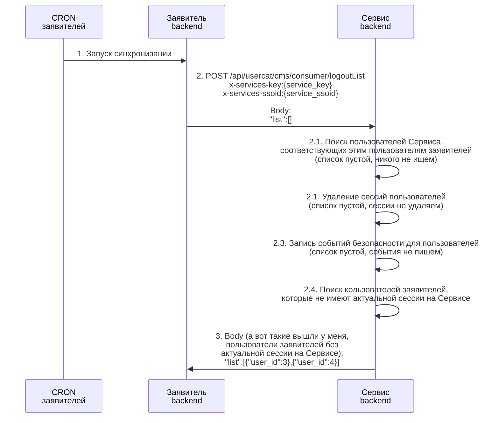
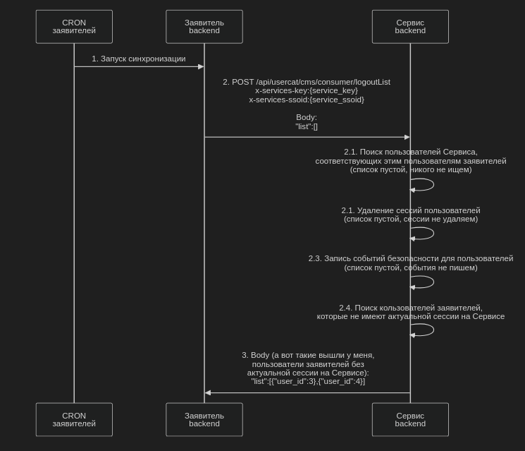

UML. Диаграмма последовательности
========

# Mermaid

## Код диаграммы

```
sequenceDiagram

    participant Consumer_cron as CRON<br>заявителей
    participant Consumer_backend as Заявитель<br/>backend
    participant Service_backend as Сервис<br/>backend


    Consumer_cron ->> Consumer_backend : 1. Запуск синхронизации
    Consumer_backend ->> Service_backend : 2. POST /api/usercat/cms/consumer/logoutList<br>x-services-key:{service_key}<br>x-services-ssoid:{service_ssoid}<br><br>Body: <br> "list":[]
    
    Service_backend ->> Service_backend : 2.1. Поиск пользователей Сервиса, <br>соответствующих этим пользователям заявителей<br/>(список пустой, никого не ищем)
    Service_backend ->> Service_backend : 2.1. Удаление сессий пользователей <br>(список пустой, сессии не удаляем)
    Service_backend ->> Service_backend : 2.3. Запись событий безопасности для пользователей <br>(список пустой, события не пишем)
    Service_backend ->> Service_backend : 2.4. Поиск кользователей заявителей, <br/>которые не имеют актуальной сессии на Сервисе 
    
    Service_backend ->> Consumer_backend : 3. Body (а вот такие вышли у меня,<br>пользователи заявителей без <br>актуальной сессии на Сервисе):<br>"list":[{"user_id":3},{"user_id":4}]

```

## Вид диаграммы в GitHub или Gitlab
(Если поддерживается плагин)


## Изображение диаграммы
(если плагин Mermaid в github или gitlab не поддерживается)


# PlantUml

FIXME