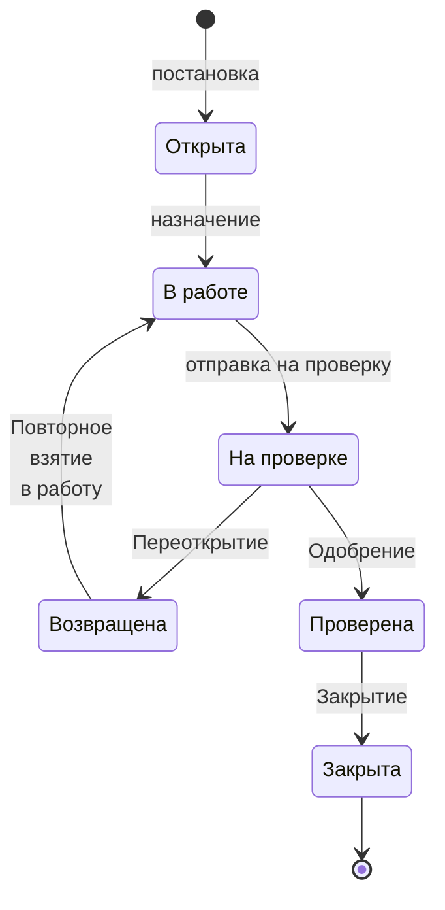
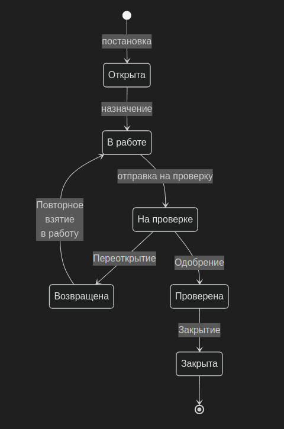
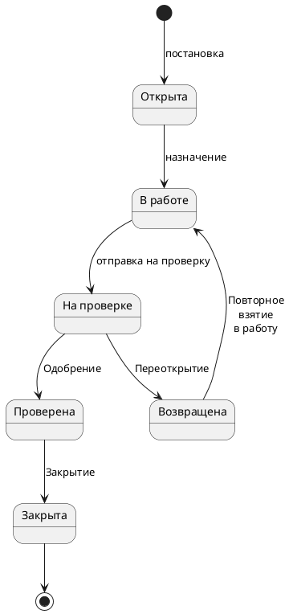

UML. Диаграмма состояний
===========================

# Mermaid
```
stateDiagram

    state "Открыта" as Opened
    state "В работе" as InProgress
    state "На проверке" as InReview
    state "Возвращена" as Reopened
    state "Проверена" as Passed
    state "Закрыта" as Closed

    [*] --> Opened : постановка
    Opened --> InProgress : назначение
    InProgress --> InReview : отправка на проверку
    InReview --> Reopened : Переоткрытие
    Reopened --> InProgress : Повторное<br>взятие<br>в работу
    InReview --> Passed : Одобрение
    Passed --> Closed : Закрытие
    Closed --> [*] 
```


## Код

## Вид диаграммы в GitHub или Gitlab
(Если поддерживается плагин)



## Изображение диаграммы



# PlantUml

## Код

[В отдельном файле](./state_dia_01.wsd)

## Изображение



