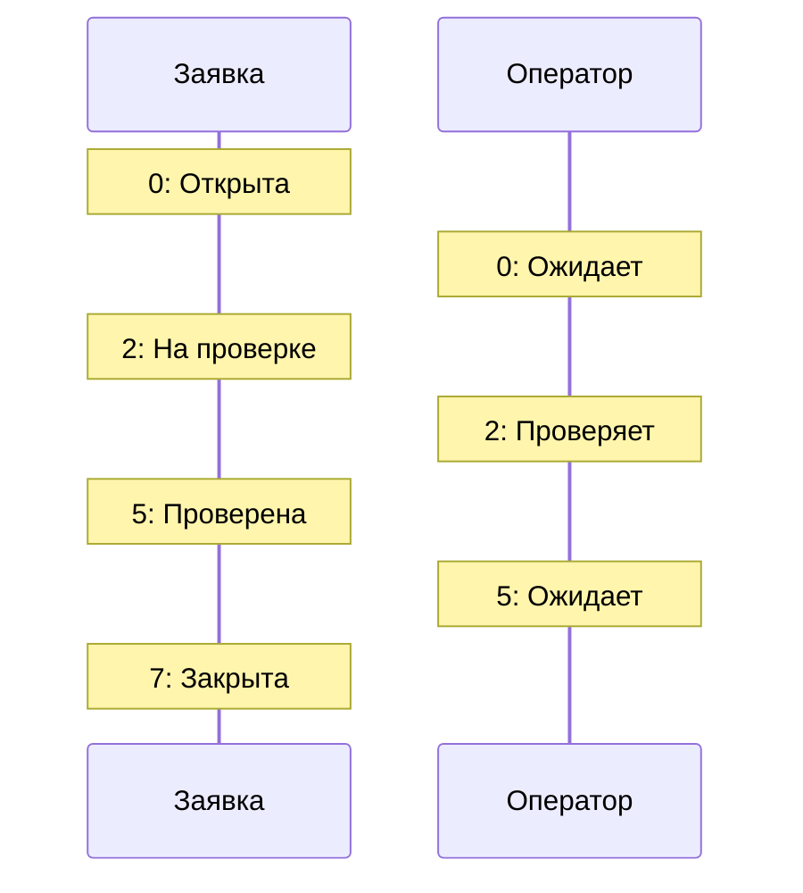
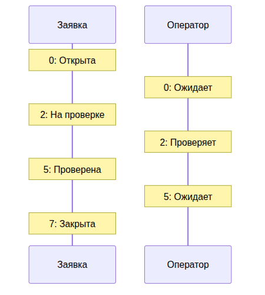
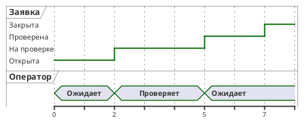

UML. Диаграмма синхронизации
============================

## Назначение

Диаграмма синхронизации (времён) описывает изменение состояний объектов во времени с учётом длительностей и моментов событий. Применяется для моделирования систем реального времени и временных ограничений.

## Описание примера

Показано изменение состояния заявки (Открыта → На проверке → Проверена → Закрыта) и занятости оператора (Ожидает → Проверяет → Ожидает) во времени.

# Mermaid
(Mermaid не поддерживает диаграммы синхронизации напрямую; приведено приближение через `sequenceDiagram` с заметками по времени)

## Код

```
sequenceDiagram
    participant Application as Заявка
    participant Operator as Оператор

    Note over Application: 0: Открыта
    Note over Operator: 0: Ожидает
    Note over Application: 2: На проверке
    Note over Operator: 2: Проверяет
    Note over Application: 5: Проверена
    Note over Operator: 5: Ожидает
    Note over Application: 7: Закрыта
```

## Вид диаграммы в GitHub или Gitlab
(Если поддерживается плагин)


## Изображение диаграммы



# PlantUml

## Код

[В отдельном файле](./timing_dia_01.wsd)

## Изображение


