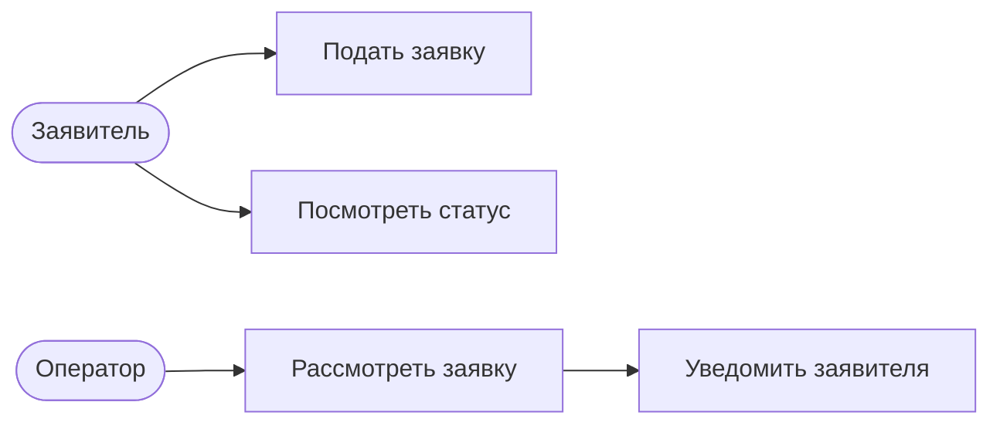
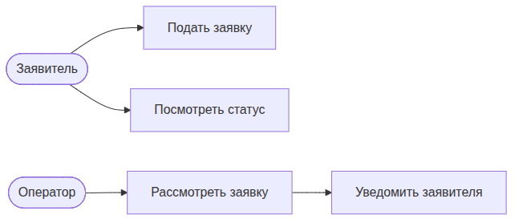
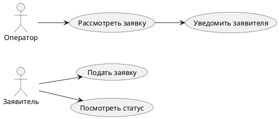

UML. Диаграмма вариантов использования
======================================

## Назначение

Диаграмма вариантов использования описывает функциональность системы с точки зрения действующих лиц (акторов) и их целей. Применяется для сбора и согласования требований.

## Описание примера

Показаны акторы «Заявитель» и «Оператор» и их варианты использования: подать заявку, посмотреть статус, рассмотреть заявку и уведомить заявителя.

# Mermaid
(Mermaid не поддерживает диаграммы вариантов использования напрямую; приведено приближение через `flowchart`)

## Код

```
flowchart LR
    ActorApplicant([Заявитель])
    ActorOperator([Оператор])

    UseCaseSubmit[Подать заявку]
    UseCaseViewStatus[Посмотреть статус]
    UseCaseReview[Рассмотреть заявку]
    UseCaseNotify[Уведомить заявителя]

    ActorApplicant --> UseCaseSubmit
    ActorApplicant --> UseCaseViewStatus
    ActorOperator --> UseCaseReview
    UseCaseReview --> UseCaseNotify
```

## Вид диаграммы в GitHub или Gitlab
(Если поддерживается плагин)


## Изображение диаграммы



# PlantUml

## Код

[В отдельном файле](./usecase_dia_01.wsd)

## Изображение


