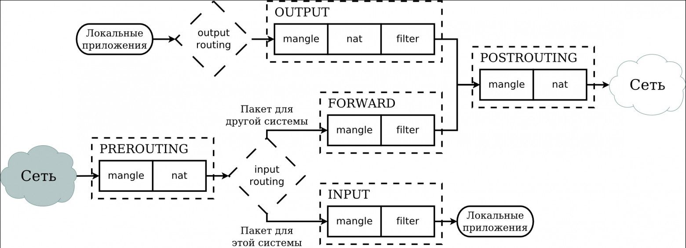

Iptables (файрвол)

# Схема прохождения пакетов




# Просмотр правил из определённой цепочки и таблицы с номерами строк

```bash
# iptables -t filter -L FORWARD --line-numbers -n
Chain FORWARD (policy DROP)
num  target     prot opt source               destination         
1    DOCKER-USER  0    --  0.0.0.0/0            0.0.0.0/0           
2    DOCKER-FORWARD  0    --  0.0.0.0/0            0.0.0.0/0           
```

- **-t filter** - просмотр таблицы filter
- **-L FORWARD** - просмотр цепочки FORWARD
- **--line-numbers** - вывести номера правил внутри цепочки

# Просмотр правил определённой таблицы из всех цепочек

```bash
# iptables -t nat --line-numbers -n
iptables v1.8.10 (nf_tables): no command specified
Try `iptables -h' or 'iptables --help' for more information.
root@rasian-ThinkCentre-M720q:/home/r-asian/sshfs# iptables -t nat -L --line-numbers -n
Chain PREROUTING (policy ACCEPT)
num  target     prot opt source               destination         
1    DOCKER     0    --  0.0.0.0/0            0.0.0.0/0            ADDRTYPE match dst-type LOCAL

Chain INPUT (policy ACCEPT)
num  target     prot opt source               destination         

Chain OUTPUT (policy ACCEPT)
num  target     prot opt source               destination         
1    DOCKER     0    --  0.0.0.0/0           !127.0.0.0/8          ADDRTYPE match dst-type LOCAL

Chain POSTROUTING (policy ACCEPT)
num  target     prot opt source               destination         
1    MASQUERADE  0    --  172.18.0.0/16        0.0.0.0/0           
2    MASQUERADE  0    --  172.100.33.0/24      0.0.0.0/0           
3    MASQUERADE  0    --  172.17.0.0/16        0.0.0.0/0           

Chain DOCKER (2 references)# iptables -t nat --line-numbers -n
iptables v1.8.10 (nf_tables): no command specified
Try `iptables -h' or 'iptables --help' for more information.
root@rasian-ThinkCentre-M720q:/home/r-asian/sshfs# iptables -t nat -L --line-numbers -n
Chain PREROUTING (policy ACCEPT)
num  target     prot opt source               destination         
1    DOCKER     0    --  0.0.0.0/0            0.0.0.0/0            ADDRTYPE match dst-type LOCAL

Chain INPUT (policy ACCEPT)
num  target     prot opt source               destination         

Chain OUTPUT (policy ACCEPT)
num  target     prot opt source               destination         
1    DOCKER     0    --  0.0.0.0/0           !127.0.0.0/8          ADDRTYPE match dst-type LOCAL

Chain POSTROUTING (policy ACCEPT)
num  target     prot opt source               destination         
1    MASQUERADE  0    --  172.18.0.0/16        0.0.0.0/0           
2    MASQUERADE  0    --  172.100.33.0/24      0.0.0.0/0           
3    MASQUERADE  0    --  172.17.0.0/16        0.0.0.0/0           

Chain DOCKER (2 references)
num  target     prot opt source               destination         
1    RETURN     0    --  0.0.0.0/0            0.0.0.0/0           
2    RETURN     0    --  0.0.0.0/0            0.0.0.0/0           
3    RETURN     0    --  0.0.0.0/0            0.0.0.0/0           
4    DNAT       6    --  0.0.0.0/0            0.0.0.0/0            tcp dpt:8081 to:172.18.0.2:8080
5    DNAT       6    --  0.0.0.0/0            0.0.0.0/0            tcp dpt:5436 to:172.100.33.3:5432
6    DNAT       6    --  0.0.0.0/0            0.0.0.0/0            tcp dpt:5433 to:172.100.33.2:5432
7    DNAT       6    --  0.0.0.0/0            0.0.0.0/0            tcp dpt:5434 to:172.100.33.4:5432
8    DNAT       6    --  0.0.0.0/0            0.0.0.0/0            tcp dpt:5437 to:172.100.33.5:5432
9    DNAT       6    --  0.0.0.0/0            0.0.0.0/0            tcp dpt:5435 to:172.100.33.7:5432
10   DNAT       6    --  0.0.0.0/0            0.0.0.0/0            tcp dpt:11211 to:172.100.33.8:11211
11   DNAT       6    --  0.0.0.0/0            0.0.0.0/0            tcp dpt:5672 to:172.100.33.10:5672
12   DNAT       6    --  0.0.0.0/0            0.0.0.0/0            tcp dpt:15672 to:172.100.33.10:15672
13   DNAT       6    --  0.0.0.0/0            0.0.0.0/0            tcp dpt:8501 to:172.100.33.19:80
14   DNAT       6    --  0.0.0.0/0            0.0.0.0/0            tcp dpt:8520 to:172.100.33.21:80

num  target     prot opt source               destination         
1    RETURN     0    --  0.0.0.0/0            0.0.0.0/0           
2    RETURN     0    --  0.0.0.0/0            0.0.0.0/0           
3    RETURN     0    --  0.0.0.0/0            0.0.0.0/0           
4    DNAT       6    --  0.0.0.0/0            0.0.0.0/0            tcp dpt:8081 to:172.18.0.2:8080
5    DNAT       6    --  0.0.0.0/0            0.0.0.0/0            tcp dpt:5436 to:172.100.33.3:5432
6    DNAT       6    --  0.0.0.0/0            0.0.0.0/0            tcp dpt:5433 to:172.100.33.2:5432
7    DNAT       6    --  0.0.0.0/0            0.0.0.0/0            tcp dpt:5434 to:172.100.33.4:5432
8    DNAT       6    --  0.0.0.0/0            0.0.0.0/0            tcp dpt:5437 to:172.100.33.5:5432
9    DNAT       6    --  0.0.0.0/0            0.0.0.0/0            tcp dpt:5435 to:172.100.33.7:5432
10   DNAT       6    --  0.0.0.0/0            0.0.0.0/0            tcp dpt:11211 to:172.100.33.8:11211
11   DNAT       6    --  0.0.0.0/0            0.0.0.0/0            tcp dpt:5672 to:172.100.33.10:5672
12   DNAT       6    --  0.0.0.0/0            0.0.0.0/0            tcp dpt:15672 to:172.100.33.10:15672
13   DNAT       6    --  0.0.0.0/0            0.0.0.0/0            tcp dpt:8501 to:172.100.33.19:80
14   DNAT       6    --  0.0.0.0/0            0.0.0.0/0            tcp dpt:8520 to:172.100.33.21:80

```

# Просмотр правил в определённой цепочке и таблице со статистикой пакетов

```bash
s# iptables -t filter -L FORWARD --line-numbers -n -v
Chain FORWARD (policy DROP 0 packets, 0 bytes)
num   pkts bytes target     prot opt in     out     source               destination         
1      382 22440 DOCKER-USER  0    --  *      *       0.0.0.0/0            0.0.0.0/0           
2      382 22440 DOCKER-FORWARD  0    --  *      *       0.0.0.0/0            0.0.0.0/0           

```


# Удаление правила по имени цепочки и номеру правила


```bash
# iptables -t filter -L INPUT  --line-numbers -n -v
Chain INPUT (policy ACCEPT 30741 packets, 8514K bytes)
num   pkts bytes target     prot opt in     out     source               destination         
1    30741 8514K FILTERS    0    --  *      *       0.0.0.0/0            0.0.0.0/0           
```

```bash
# iptables -t filter -D INPUT 1
```

```bash
# iptables -t filter -L INPUT  --line-numbers -n -v
Chain INPUT (policy ACCEPT 35384 packets, 9401K bytes)
num   pkts bytes target     prot opt in     out     source               destination
```